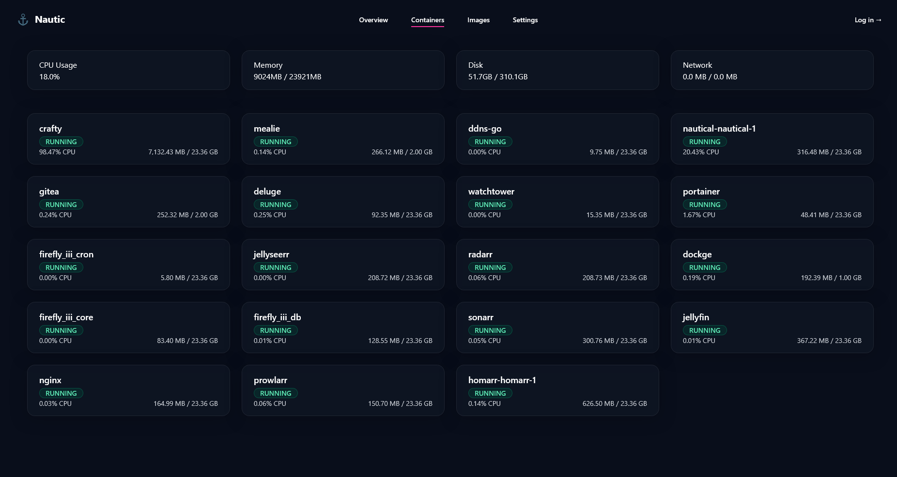

# Nautic

Nautic is a modern, self-hosted Docker dashboard inspired by the calm precision of maritime control systems.  
It provides real-time visibility into your containers, system resources, and hardware health — all from a clean, glass-blurred interface.



---

## Overview

Nautic aims to be your **captain’s dashboard** for Docker environments.  
It combines container management with hardware monitoring in one place, using a futuristic maritime design language.

### Core Features
- **Container Overview** — List running, stopped, and paused containers with real-time state updates.  
- **Resource Monitoring** — View CPU, memory, and network usage per container.  
- **System Stats** — Check host-level metrics like CPU load, memory usage, and available storage.  
- **Hardware Insights** — Access detailed system information via [Hardware.Info](https://github.com/LibreHardwareMonitor/Hardware.Info).  
- **Cross-Platform Support** — Works on Windows, Linux, and macOS (tested on Debian 13, CasaOS, and Windows 11).  
- **Blurred Glass Aesthetic** — A sleek, frosted dashboard inspired by Homarr and CasaOS.  

---

## Installation

### 1. Pull from Docker Hub

```bash
docker pull yourusername/nautic:latest
```

### 2. Pull from Docker Hub

```yaml
services:
  nautic:
    image: nerrry/nautic:latest
    container_name: nautic
    restart: unless-stopped
    user: root
    ports:
      - "8080:8080"
    volumes:
      - /var/run/docker.sock:/var/run/docker.sock
    user: root
```

Then start it:
```bash
docker compose up -d
```

Once running, visit http://localhost:8080

---

## Permissions

To read Docker container data, Nautic needs access to `/var/run/docker.sock`.
If you encounter a Permission denied error:

- Ensure your container runs as `root`, or
- Add the running user to the `docker` group inside the container.

---

## Architecture

Nautic is built using:
- `.NET 8 (Blazor Server)` for the UI and backend integration
- `Docker.DotNet` for container interaction
- `Hardware.Info` for hardware monitoring
- `Tailwind CSS` for responsive styling and theming

---

## Roadmap

- Container start/stop controls
- Image management and pruning
- CPU, Disk and network graph visualizations
- Notifications and health alerts
- Cloudflare integration for domain management

---

## Acknowledgements

Nautic would not be possible without the following excellent open-source projects:
- [Docker.DotNet](https://github.com/moby/moby/tree/master/src/Docker.DotNet) — .NET client library for the Docker Engine API
- [Hardware.Info](https://github.com/LibreHardwareMonitor/Hardware.Info) — System hardware and sensor data library
- [Tailwind CSS](https://tailwindcss.com/) — Utility-first CSS framework for styling
- [Blazor](https://dotnet.microsoft.com/apps/aspnet/web-apps/blazor) — Modern .NET web framework for interactive UIs

---

## License

This project is licensed under the MIT License.
See the [LICENSE](./LICENSE.txt) for details.

---

## ⚓ Contributing

Contributions, suggestions, and feedback are welcome.
Open an issue or submit a pull request to help make Nautic even better.